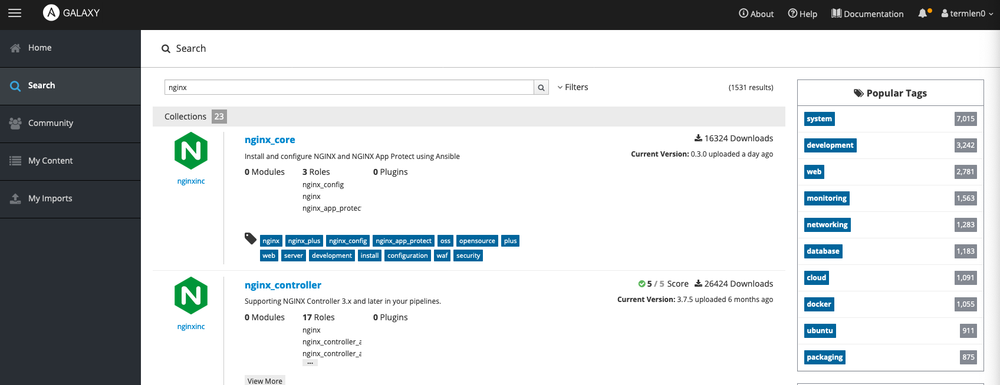
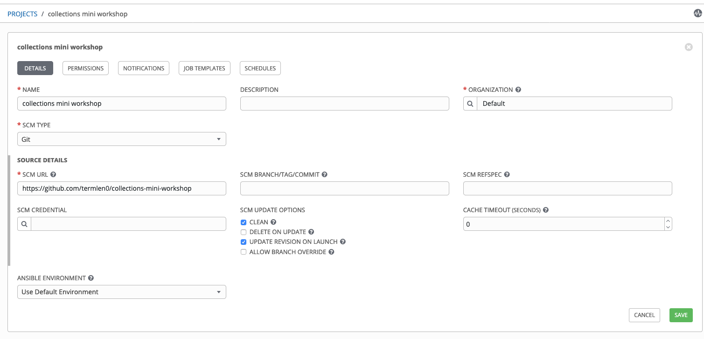
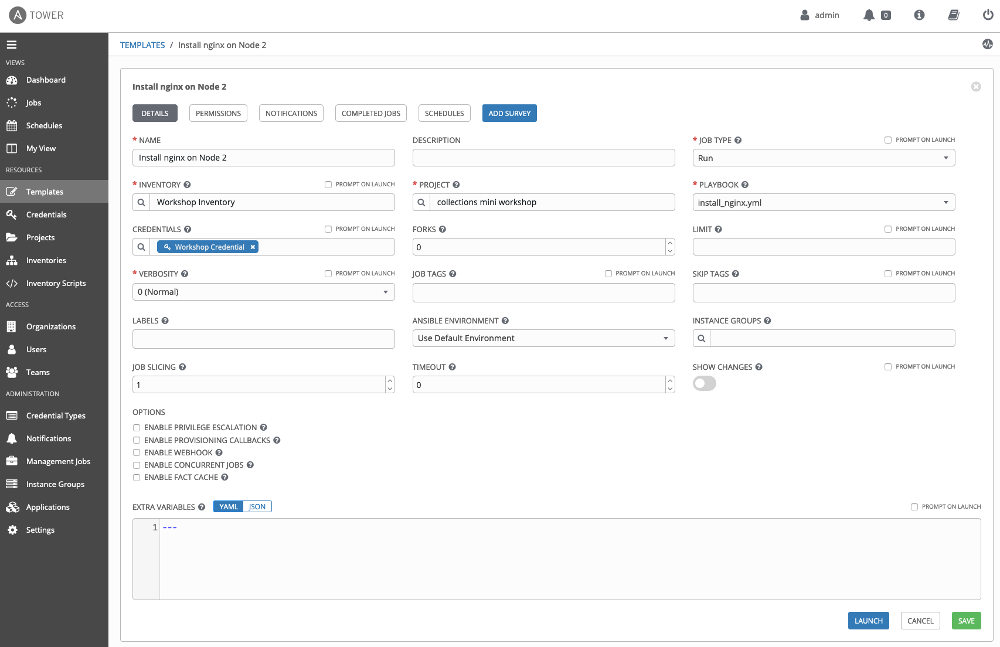
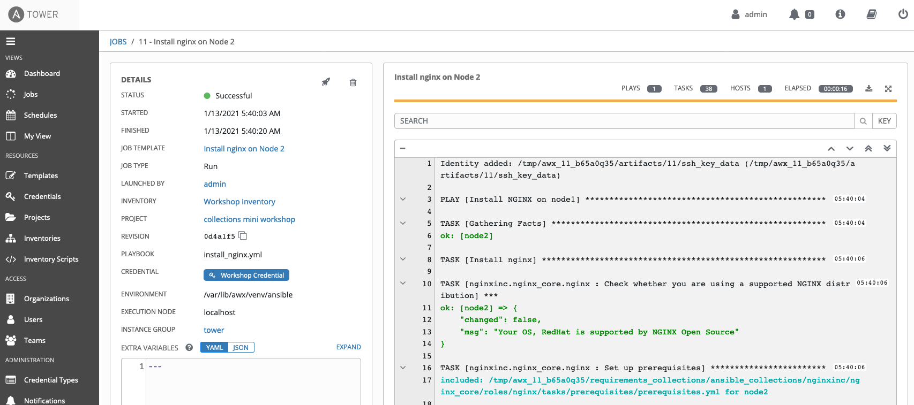

# Goal:
The primary objective of this mini-workshop is to help gain an
understanding of working with Ansible collections.

## Pre-reqs:
- The user is familiar with Ansible and Ansible roles
- An environment with Ansible 2.9 and Ansible Tower 3.7 or greater installed
- A github account (for section 3 onward)

### SECTION 1: Using a community collection from the command line

In this section you will learn how to use a collection from the
upstream Ansible Galaxy collection repository

##### STEP 1: Create the necessary directory

Create a *demo-collection* directory in your home directory

``` bash
[student1@ansible-1 ~]$ mkdir demo-collection
[student1@ansible-1 ~]$ cd demo-collection/
[student1@ansible-1 demo-collection]$
```

This will be the base directory to build a playbook that uses an
upstream collection.


##### STEP 2: Download the nginx collection

Navigate to https://galaxy.ansible.com and search for nginx. You should
see a result like:



We will use the **nginx_core** collection. Click on it and review the
contents.

##### STEP 3: Install the collection

The collection info page shows how to install the collection:

`ansible-galaxy collection install nginxinc.nginx_core`

Go ahead and execute this on your control machine:

``` bash
[student1@ansible-1 demo-collection]$ ansible-galaxy collection install nginxinc.nginx_core
Process install dependency map
Starting collection install process
Installing 'nginxinc.nginx_core:0.3.0' to '/home/student1/.ansible/collections/ansible_collections/nginxinc/nginx_core'
[student1@ansible-1 demo-collection]$
```

> NOTE: Note that the collection has been installed by default into
> the $HOME/.ansible path

##### STEP 4: Use the downloaded collection

Collections are invoked by providing a FQCN (Fully Qualified
Collection Name) while accessing it from your playbook.

Create a playbook called *install_nginx.yml* to invoke the task from
the collection.

``` yaml
---
- name: Install NGINX on node1
  hosts: node1
  become: yes
  tasks:
    - name: Install nginx
      include_role:
        name: nginxinc.nginx_core.nginx
```


##### STEP6: Run the playbook

Execute the playbook : `ansible-playbook install-nginx.yml`

``` bash
[student1@ansible-1 demo-collection]$ ansible-playbook install-nginx.yml

PLAY [Install NGINX on node1] ****************************************************************************************************************************************************************************************

TASK [Gathering Facts] ***********************************************************************************************************************************************************************************************
ok: [node1]

TASK [Install nginx] *************************************************************************************************************************************************************************************************

TASK [nginxinc.nginx_core.nginx : Check whether you are using a supported NGINX distribution] ************************************************************************************************************************
ok: [node1] => changed=false
  msg: Your OS, RedHat is supported by NGINX Open Source

TASK [nginxinc.nginx_core.nginx : Set up prerequisites] **************************************************************************************************************************************************************
included: /home/student1/.ansible/collections/ansible_collections/nginxinc/nginx_core/roles/nginx/tasks/prerequisites/prerequisites.yml for node1

TASK [nginxinc.nginx_core.nginx : Install dependencies] **************************************************************************************************************************************************************
included: /home/student1/.ansible/collections/ansible_collections/nginxinc/nginx_core/roles/nginx/tasks/prerequisites/install-dependencies.yml for node1

TASK [nginxinc.nginx_core.nginx : (Alpine Linux) Install dependencies] ***********************************************************************************************************************************************
skipping: [node1]

TASK [nginxinc.nginx_core.nginx : (Debian/Ubuntu) Install dependencies] **********************************************************************************************************************************************
skipping: [node1]

TASK [nginxinc.nginx_core.nginx : (Amazon Linux/CentOS/Oracle Linux/RHEL) Install dependencies] **********************************************************************************************************************
ok: [node1]

.
.
.
.
< truncated for brevity>
.
.
.
RUNNING HANDLER [nginxinc.nginx_core.nginx : (Handler) Start/reload NGINX] *******************************************************************************************************************************************
changed: [node1]

RUNNING HANDLER [nginxinc.nginx_core.nginx : (Handler) Check NGINX] **************************************************************************************************************************************************
ok: [node1]

RUNNING HANDLER [nginxinc.nginx_core.nginx : (Handler) Print NGINX error if syntax check fails] **********************************************************************************************************************
skipping: [node1]

TASK [nginxinc.nginx_core.nginx : Debug NGINX output] ****************************************************************************************************************************************************************
skipping: [node1]

TASK [nginxinc.nginx_core.nginx : Configure logrotate for NGINX] *****************************************************************************************************************************************************
skipping: [node1]

TASK [nginxinc.nginx_core.nginx : Install NGINX Amplify] *************************************************************************************************************************************************************
skipping: [node1]

PLAY RECAP ***********************************************************************************************************************************************************************************************************
node1                      : ok=14   changed=4    unreachable=0    failed=0    skipped=23   rescued=0    ignored=0


```


### SECTION 2: Using a community collection from Ansible Tower


In this section, we'll see how easy it is to use this playbook
from Ansible Tower.


##### STEP 1: Galaxy Settings
Review the Galaxy configuration in Tower. Login as an admin into Tower
and Navigate to *Jobs>Settings* on your Tower.


> NOTE: This is where you would configure your enterprise
> automation hub settings


##### STEP 2: Review the source code for the Ansible Tower Project

Navigate to
https://github.com/termlen0/collections-mini-workshop

Review the *install_nginx* playbook here. You will notice that the playbook is
identical to the one we ran earlier - except that it will run against
node2 now.

Also review the **collections**  directory. Open the *requirements.yml*
file within this directory:

``` yaml
collections:
  - name: nginxinc.nginx_core
    source: https://galaxy.ansible.com
```

> Tower will parse this file and install the necessary collections
> needed for the execution of our playbook.


##### STEP 3: Create the Ansible Tower Project and Job Template

**Project**




**Job Template**


##### STEP 4: Launch the Job Template

Launch the job template. You should see the familiar playbook output:



>NOTE: you did not have to install the collection manually. Tower
>handles it for you.


### SECTION 3: Migrating your existing role(s) as a collection

[Migrating existing roles as collections](./migrate_roles.md)
