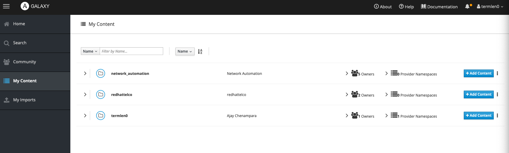
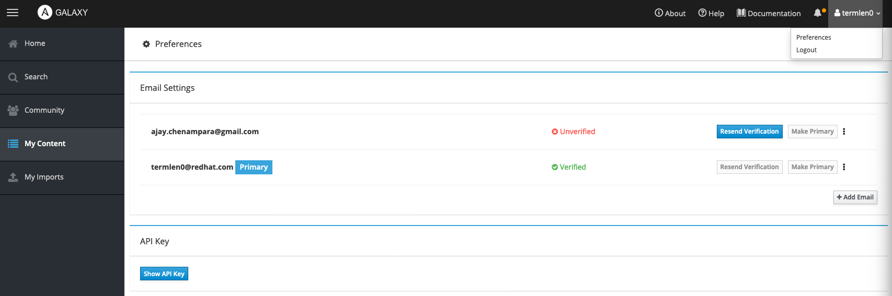
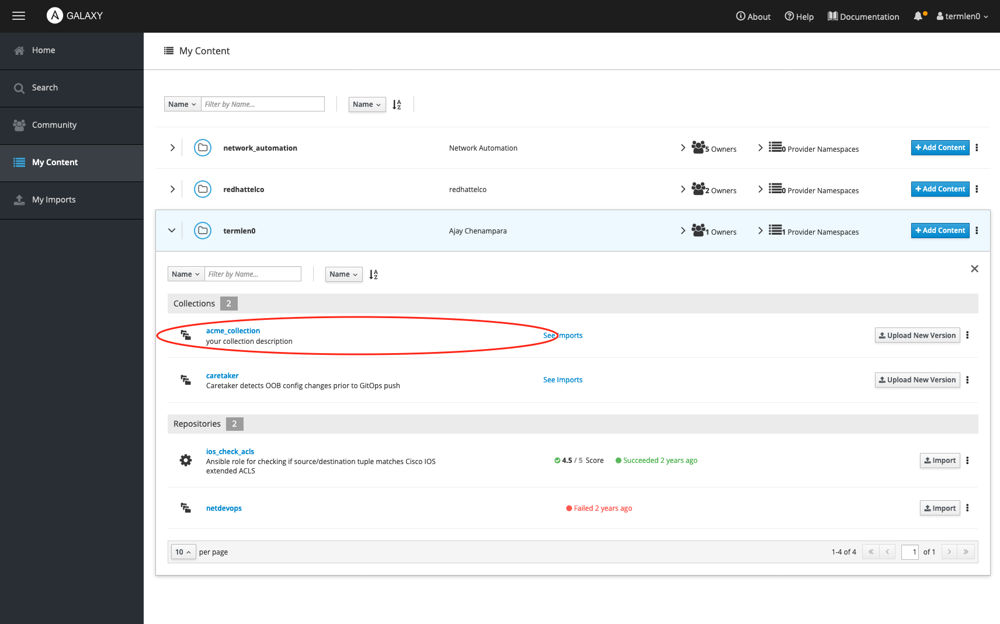
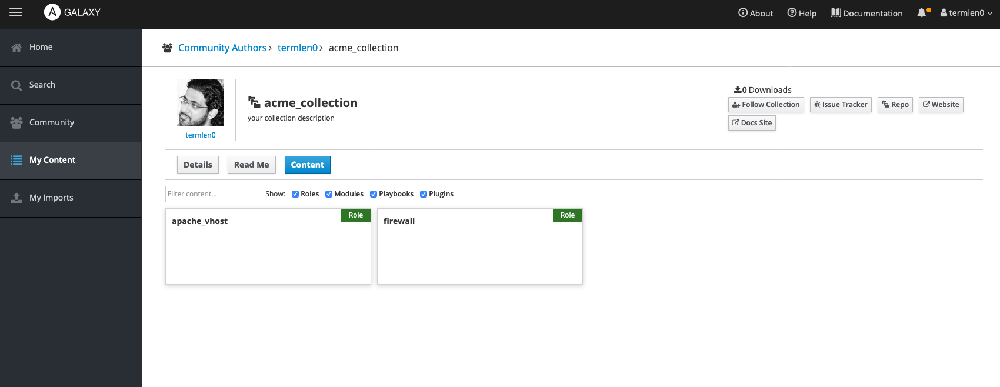

#### Task 1: Create an Ansible Galaxy account

For this workshop, we will host the collection you create on
https://galaxy.ansible.com. This is considered an *upstream*
repository for user content and is world readable. For enterprise
applications you would be using the private automation hub, which can
be hosted on premises or in any secure compute environment
(private/public clouds etc).

##### STEP 1:
Navigate to https://galaxy.ansible.com and create a galaxy account
using your github account.

On the left menu, click on **My Content**. This will reveal all the
namespaces you have access to.



##### STEP 2:
Navigate to your username (top-right) and click on preferences.
. Verify your email.

Also click on the **Show API** button and save that information
locally on your laptop somewhere. You will need this in a later step.

#### Task 2: Fork and Clone this repository

##### STEP 1:
Click on the *Fork* button to fork this repository under your own github.

##### STEP 2:
Clone this repository onto your control machine.

>NOTE: Make sure you are doing this from the home directory

``` bash
[student1@ansible-1 ~]$ git clone https://github.com/<your_user>/collections-mini-workshop
Cloning into 'collections-mini-workshop'...
remote: Enumerating objects: 3, done.
remote: Counting objects: 100% (3/3), done.
remote: Total 3 (delta 0), reused 3 (delta 0), pack-reused 0
Unpacking objects: 100% (3/3), 200 bytes | 200.00 KiB/s, done.

[student1@ansible-1 ~]$ cd collections-mini-workshop/
[student1@ansible-1 collections-mini-workshop]$

```

You should see an old-role directory that has an existing playbook
that invokes multiple roles. You will not execute this.  As we
discussed, collections are a new way of packaging content, in the
Ansible Automation platform. We also spent time to understand the
value of this packaging format.  A common situation that users
encounter is that they have already invested time and effort and
already have roles that are being used in their playbooks and they
might want to refactor some of these roles as collections.  In this
section of the mini-workshop, you will simply refactor these existing
roles as community collections and then learn how to use them with
Ansible Tower.

##### STEP 3: Initialize a collection

``` bash
$ ansible-galaxy collection init --init-path mycollections termlen0.acme_collection

- Collection termlen0.acme_collection was created successfully
```

> NOTE: Replace termlen0 above, with your own galaxy namespace.

Switch to the acme_collection directory:

`$ cd mycollections/termlen0/acme_collection/`

Let's take a look at the directory structure and files that were
auto-generated:

``` bash
$ tree
.
├── docs
├── galaxy.yml
├── plugins
│   └── README.md
├── README.md
└── roles

3 directories, 3 files

```

A short description of the collection structure:

- The plugins folder holds plugins, modules, and module_utils that can
  be reused in playbooks and roles.

- The roles folder hosts custom roles, while all collection
  playbooks must be stored in the playbooks folder.

- The docs folder can be used for the collections documentation, as
  well as the main README.md file that is used to describe the
  collection and its content.

- The tests folder holds tests written for the collection.

- The galaxy.yml file is a YAML text file that contains all the
  metadata used in the Ansible Galaxy hub to index the
  collection. It is also used to list collection dependencies, if
  there are any.


Ansible collections support [semantic versioning](https://semver.org/).
 Every time the collection is updated, the galaxy.yml
file has to be updated with a version number.

##### STEP 4: Move the old roles into the new collection data structure

Simply copy over the old roles into the new collection's roles
directory:


``` bash
$ cp -r ../../../old-role/roles/* roles/
$ tree -L 2
.
├── docs
├── galaxy.yml
├── plugins
│   └── README.md
├── README.md
└── roles
    ├── apache_vhost
    └── firewall

5 directories, 3 files

```

##### STEP 5: Update galaxy.yml

Update the following sections in galaxy.yml file

- *authors*
- *description*

>NOTE: Each time you update any file in your collection. Make sure you
>update the semantic version of the collection.

You should also update the documentation, homepage, repository etc
when you start writing collections that others will use.

##### STEP 5: Build the collection

Build the collection using `ansible-galaxy collection build`

``` bash
acme_collection]$ ansible-galaxy collection build
Created collection for termlen0.acme_collection at /vagrant/collections-mini-workshop/mycollections/termlen0/acme_collection/termlen0-acme_collection-1.0.0.tar.gz
[vagrant@ansible-tower acme_collection]$

```

At this point, you could install the collection and use it using
`ansible-galaxy collection install <collection-name>.tar.gz`

##### STEP 6: Push the collection to the upstream galaxy

The collection you built can now be pushed into the upstream galaxy:

``` bash
[vagrant@ansible-tower acme_collection]$ ansible-galaxy collection publish termlen0-acme_collection-1.0.2.tar.gz --api-key='XXXXXXXXXXXXXXXXXXXXXXX'
Publishing collection artifact '/vagrant/collections-mini-workshop/mycollections/termlen0/acme_collection/termlen0-acme_collection-1.0.2.tar.gz' to default https://galaxy.ansible.com/api/
Collection has been published to the Galaxy server default https://galaxy.ansible.com/api/
Waiting until Galaxy import task https://galaxy.ansible.com/api/v2/collection-imports/7245/ has completed
Collection has been successfully published and imported to the Galaxy server default https://galaxy.ansible.com/api/
[vagrant@ansible-tower acme_collection]$

```

This is where you would use your API key to push your content into
your namespace.


You can now see the collection you pushed upstream by navigating to
your namespace in galaxy:





